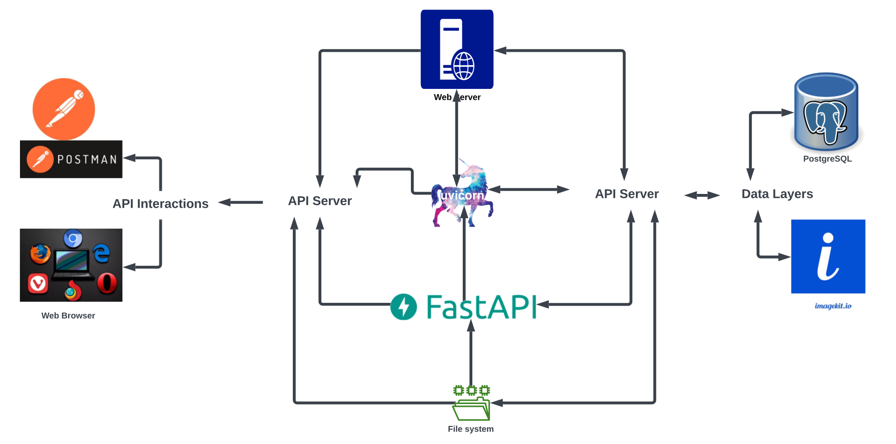

# Verbum Antiqua "The Ancient Word"

## Introduction

Verbum Antiqua is a social media platform where users can share quotes and ancient words of wisdom. The project aims to create a community for enthusiasts of timeless knowledge, offering features such as user authentication, posting updates and interacting with posts.

### Key Features:

- API server built with FastAPI
- User authentication
- Posting and interacting with quotes
- Community engagement through comments and replies

My goal is to create a space where like-minded individuals can share their favorite quotes and words from the past, preserving their meanings for generations to come.

## How It Works



Verbum Antiqua consists of the following components:

### Applications

+ **PostgreSQL**
+ **Python3**

### APIs
+ **Google API** : Created with at least an email sending scope and the API server's root URL as one of the redirect URIs, from which the `credentials.json` and `token.json` files are generated.
+ **ImageKit.io API**: Used for CDN management. The public key, private key, and URL endpoint are saved in the `.env.local` file located in the [Project Main Directory](va_backend/)

### Environment Variables

The environment variables required for this project are stored in the `.env.local` file in `key=value` format. The table below provides details on the required variables:

| Name | Description |
|:-|:-|
| DATABASE_URL | The URL of the PostgreSQL database to connect to. |
| APP_MAX_SIGNIN | The maximum number of sign in attempts a user can make in succession. |
| IMG_CDN_PUB_KEY | Imagekit.io public key. |
| IMG_CDN_PRIV_KEY | Imagekit.io private key. |
| IMG_CDN_URL_ENDPNT | Imagekit.io url endpoint. |
| GMAIL_SENDER | The email address of the account responsible for sending emails to users. |
| FRONTEND_DOMAIN | The domain name of the frontend (Incase a frontend is designed for the project). | 
| APP_SECRET_KEY | The secret key for this application. |

## Installation

+ **Clone this repository by running the following command:**
```zsh
git clone https://github.com/thisisteey/Verbum-Antiqua.git
```

+ **Navigate to the `va_backend` directory:**
```zsh
cd va_backend
```

+ **Create the environment variables mentioned above**

+ **Create a virtual environment:**

  #### mac0S and Linux:
    
    + Ensure that `python3` is installed on your system.
    + Run the following command to create a virtual enviroment:
    ```zsh
    python3 -m venv venv
    ```

    + Activate the virtual enviroment
    ```zsh
    source venv/bin/activate
    ```

  #### Windows:

    + Ensure that `python3` is installed on your system.
    + Run the following command to create a virtual enviroment:
    ```cmd
    python -m venv venv
    ```

    + Acitvate the virtual enviroment
    ```cmd
    venv\Scripts\activate
    ```

+ **Install the required dependencies:**
```zsh
pip3 install -r requirements.txt
```

+ **Start the PostgreSQL and Initialize the Database:**

  + Ensure `PostgreSQL` is installed on your system.
  + Run the following command to start the PostgreSQL services

| Step                                  | macOS (Homebrew)                                      | Linux                                             | Windows (Command Prompt)                              |
|:-|:-|:-|:-|
| **Start PostgreSQL service**          | ```brew services start postgresql```         | ```sudo service postgresql start```        | ```net start postgresql```                    |
| **Open interactive shell**            | ```psql postgres```                          | ```sudo -s -u postgres```                  | ```psql -U postgres```                        |
| **Initialize the database**           | ```\i db_setup/DBSetup.sql```                  | ```psql -f db_setup/DBSetup.sql```          | ```\i db_setup/DBSetup.sql```                 |
| **Exit the interactive shell**        | ```\q```                                      | ```exit```                                | ```\q```                                      |

## Usage

Run the server using
```zsh
./launch.sh
```
**NOTE:** Ensure to check the `launch.sh` script. The script is active for `zsh`, but the `bash` version is available as well.

## Demo

Watch a live demonstration of Verbum Antiqua [here](https://youtu.be/6gATfZ7KSIo).


## Documentation

The `OpenAPI` documentation for the project is available in [OpenAPI.json](OpenAPI.json) and [OpenAPI.html](OpenAPI.html) formats.

## Discussion

Discuss Verbum Antiqua on [VA Discussions](https://github.com/thisisteey/Verbum-Antiqua/discussions)

## Contributing

Contributions are welcome! Here's how you can get involved: [CONTRIBUTING](CONTRIBUTING.md)

## Author(s)

You can check out all contributor(s) to this project [Here](AUTHORS)

## Licensing

Verbum Antiqua is licensed under the MIT License. See the [LICENSE](LICENSE) file for more details.

## Connect With Me

Connect with me via the following platforms [LinkedIn](https://www.linkedin.com/in/dadataiwoadeoye) | [XfkaTwitter](https://x.com/_thisisteey) | [GitHub](https://github.com/thisisteey)
